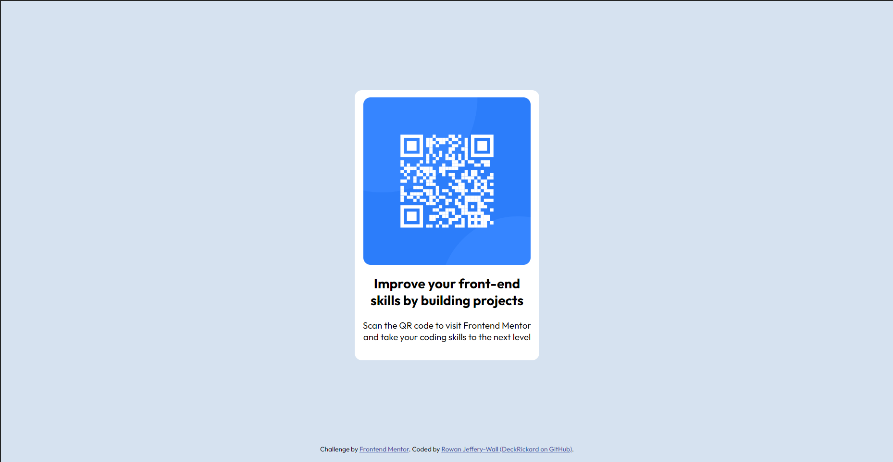

# Frontend Mentor - QR code component solution

This is a solution to the [QR code component challenge on Frontend Mentor](https://www.frontendmentor.io/challenges/qr-code-component-iux_sIO_H).

## Table of contents

- [Overview](#overview)
  - [Screenshot](#screenshot)
  - [Links](#links)
- [My process](#my-process)
  - [Built with](#built-with)
  - [What I learned](#what-i-learned)
  - [Continued development](#continued-development)
  - [Useful resources](#useful-resources)
- [Author](#author)

## Overview

### Screenshot

### Links

- Solution URL: (https://www.frontendmentor.io/solutions/qr-code-component-using-plain-html-and-css-JfGjInC8hl)
- Live Site URL: (https://deckrickard.github.io/Frontend-Mentor-qr-code-component-main/)

## My process

### Built with

- Semantic HTML5 markup
- CSS custom properties
- Flexbox

### What I learned

This was a useful refresher on basic HTML and CSS. I found this more of a test of my skills than expected. I've been mostly working on tutorials and following guides so working independently like this has been a bit of a challenge for me.

I found it useful to work through the project in a logical manner, starting at the key parent elements and then working down the tree. This prevented me from getting mixed up with CSS inheritance and things like that.

The key issue I faced working on this project was using Flexbox to center the panel. I struggled for ages until I realised that I had forgotten that I needed to give the body and html elements a height of 100% in order to allow my container element to fill the entire height of the page:

    html, body {
      height:  100%;
    }

I also found it quite tricky to guess at what scales and margins were required to best fit the design. I was quite surprised to see the difference in scale between my solution and the design image.

### Continued development

I would like to really lock-down my Flexbox skills through continued practice. 

### Useful resources

I used various articles on [MDN Web Docs](https://developer.mozilla.org/en-US/) and [W3 Schools](https://www.w3schools.com) to refresh my knowledge.

My CSS and HTML knowledge has thus far come exclusively from [FreeCodeCamp](https://www.freecodecamp.org) - I would recommend this resource to anyone. After following the tutorials on **FreeCodeCamp** I have found it useful to use [Frontend Mentor](https://www.frontendmentor.io/) to practice my skills independently.

## Author

- Frontend Mentor - [@DeckRickard](https://www.frontendmentor.io/profile/DeckRickard)
- GitHub - [DeckRickard](https://github.com/DeckRickard)

